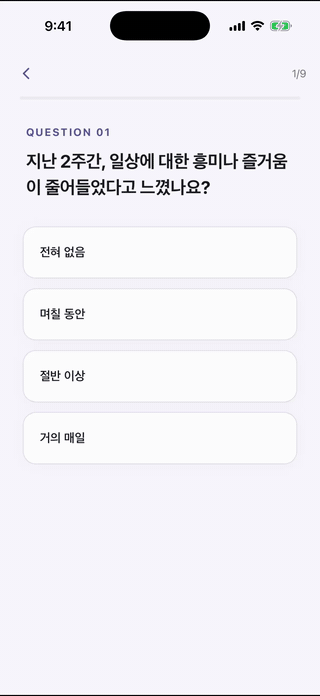
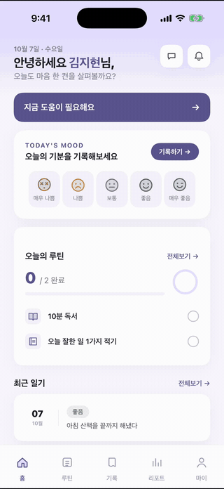
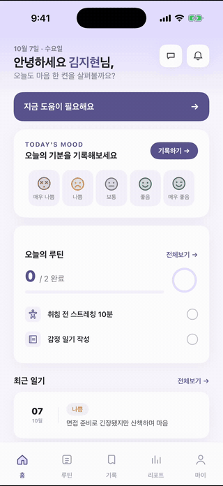
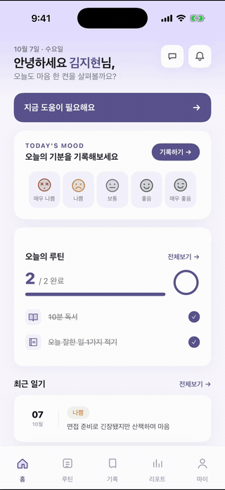
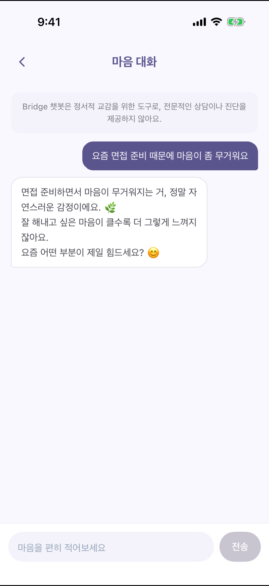
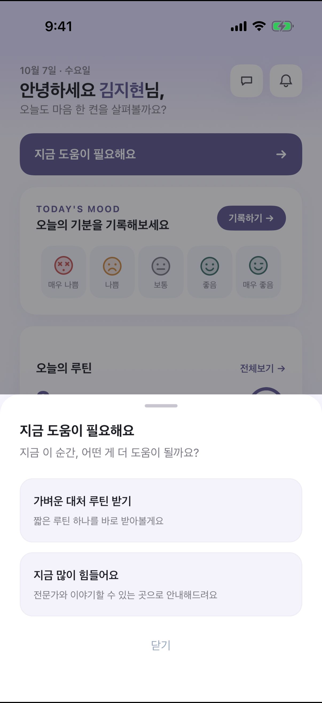
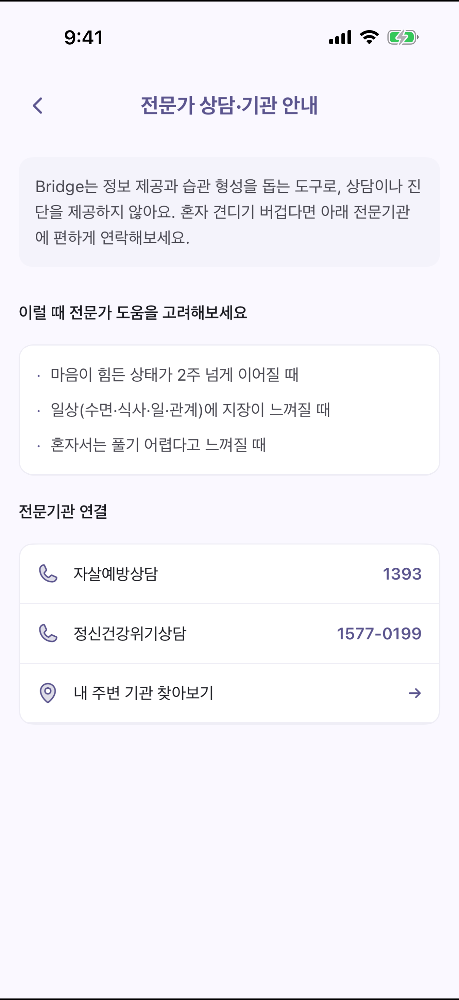
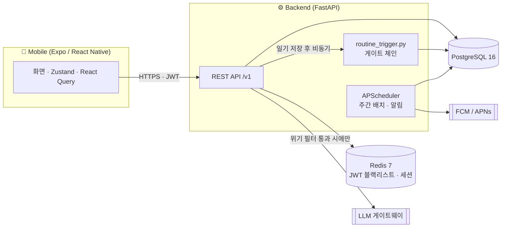

<div align="center">


# Bridge

**청년(19~34세)을 위한 디지털 정서 웰니스 앱**

감정 기록과 작은 루틴으로 하루의 마음을 살피고,
혼자 버티기 어려울 때는 전문기관으로 이어 주는 *다리*가 되는 것을 목표로 합니다.


순천향대학교 컴퓨터소프트웨어공학과 졸업작품

</div>

> [!IMPORTANT]
> **Bridge는 진단·치료 서비스가 아닙니다.**
> 정보 제공과 습관 형성을 돕는 도구로 설계했으며, 의료기기에 해당하지 않습니다.
> 앱 안의 어떤 화면도 점수나 의학적 구간명을 사용자에게 보여 주지 않습니다.

---

## 목차

- [기획 배경](#기획-배경)
- [사용 흐름](#사용-흐름)
- [화면 구성](#화면-구성)
- [주요 기능](#주요-기능)
- [안전·개인정보 설계](#안전개인정보-설계)
- [아키텍처](#아키텍처)
- [기술 스택](#기술-스택)
- [실행 방법](#실행-방법)
- [테스트](#테스트)
- [API 개요](#api-개요)
- [프로젝트 구조](#프로젝트-구조)
- [개발 현황](#개발-현황)
- [문서](#문서)

---

## 기획 배경

마음이 힘든 청년 상당수는 병원을 찾기 전 단계에 있습니다. 도움이 필요하다고 느끼면서도 진료를 받기에는 부담스럽고 한편으로 혼자 관리할 방법도 부족합니다. Bridge는 이 사이의 공백을 해소하는 데 초점을 둡니다.

| 문제 | Bridge의 접근 |
|------|--------------|
| 가입 절차에 대한 부담 | **익명으로 바로 시작**하고 원할 때만 이메일 계정으로 전환 |
| 자신의 상태를 언어로 정리하기 어려움 | 이모지 → 감정 키워드 → 예시 답변 순서로 **선택만으로 기록 완료** |
| 실천할 방법을 알기 어려움 | 자가평가와 최근 기록을 근거로 **작은 루틴을 맞춤 배정** |
| 혼자 감당하기 어려운 위기 상황 | 홈의 **"지금 도움이 필요해요"** 로 대처 루틴 또는 전문기관 연결 |

---

## 사용 흐름

<table>
  <tr>
    <td align="center" width="25%">
      <br/>
      <b>① 첫 실행 · 자가평가</b>
    </td>
    <td align="center" width="25%">
      <br/>
      <b>② 감정 일기 작성</b>
    </td>
    <td align="center" width="25%">
      <br/>
      <b>③ 루틴 완료 · 리포트</b>
    </td>
    <td align="center" width="25%">
      <br/>
      <b>④ AI 마음 대화</b>
    </td>
  </tr>
</table>

**① 첫 실행 · 자가평가**
앱을 처음 열면 회원가입 없이 익명 계정이 만들어지고 곧바로 9문항 자가평가가 시작됩니다. 마지막으로 요즘 마음이 무거운 이유를 고르면 결과를 쉬운 말로 안내하고 상태에 맞는 첫 루틴 2개를 배정합니다.

**② 감정 일기 작성**
오늘의 기분(5단계) → 감정 키워드(최대 2개) → 키워드별 세부 질문 → 자유 메모 순서로 진행합니다. 세부 질문에는 예시 답변이 있어 탭만으로도 기록을 마칠 수 있습니다. 메모는 서버에 암호화되어 저장됩니다.

**③ 루틴 완료 · 리포트**
오늘의 루틴을 체크하면 진행률과 응원 문구가 바로 바뀝니다. 리포트 탭에서는 주간·월간·연간 기분 추이, 자주 느낀 감정, 루틴 달성률을 확인할 수 있습니다.

**④ AI 마음 대화**
가볍게 마음을 털어놓을 수 있는 대화 화면입니다. 상담이나 진단을 하지 않는다는 점을 화면 상단에 항상 고지하며 위기 신호가 감지되면 LLM을 호출하지 않고 전문기관 안내로 바로 연결합니다.

> GIF는 iOS 시뮬레이터(iPhone 17 Pro)에서 실제 백엔드와 연동해 녹화했습니다. 화면에 보이는 이름과 기록은 모두 데모 데이터입니다.

---

## 화면 구성

<table>
  <tr>
    <td align="center" width="33%">
      <br/>
      <sub><b>홈</b><br/>오늘의 기분 · 루틴 진행률 · 최근 일기</sub>
    </td>
    <td align="center" width="33%">
      <br/>
      <sub><b>오늘의 루틴</b><br/>진행률과 달성 피드백</sub>
    </td>
    <td align="center" width="33%">
      <br/>
      <sub><b>리포트</b><br/>기분 추이 · 자주 느낀 감정 · 달성률</sub>
    </td>
  </tr>
  <tr>
    <td align="center" width="33%">
      <br/>
      <sub><b>감정 일기 목록</b><br/>기분별 필터와 키워드 태그</sub>
    </td>
    <td align="center" width="33%">
      <br/>
      <sub><b>일기 상세</b><br/>키워드 · 세부 질문 · 메모</sub>
    </td>
    <td align="center" width="33%">
      <br/>
      <sub><b>마이페이지</b><br/>미션 점수 · 달성 기록 · 자가평가 다시 하기</sub>
    </td>
  </tr>
  <tr>
    <td align="center" width="33%">
      <br/>
      <sub><b>AI 마음 대화</b><br/>비의료 고지와 함께 가벼운 대화</sub>
    </td>
    <td align="center" width="33%">
      <br/>
      <sub><b>지금 도움이 필요해요</b><br/>대처 루틴 받기 또는 전문기관 안내</sub>
    </td>
    <td align="center" width="33%">
      <br/>
      <sub><b>전문가 상담·기관 안내</b><br/>1393 · 1577-0199 · 주변 기관 찾기</sub>
    </td>
  </tr>
</table>

---

## 주요 기능

| 기능 | 설명 |
|------|------|
| **익명 우선 시작** | 기기별 비밀값으로 익명 계정을 자동 생성합니다. 원하면 이메일 인증을 거쳐 정식 계정으로 전환할 수 있습니다. |
| **자가평가 기반 초기 루틴** | PHQ-9 자가평가 결과와 사용자가 고른 원인을 바탕으로 첫 루틴을 배정합니다. 점수와 구간명은 노출하지 않습니다. |
| **감정 일기** | 기분 → 키워드 → 세부 질문 → 메모의 4단계 기록. 메모는 AES-256-GCM으로 암호화합니다. |
| **근거 기반 루틴 추천** | 최근 감정 패턴과 개인 기준선을 게이트 체인으로 판정해 필요할 때만 루틴을 추천합니다. 기본값은 "추천하지 않음"입니다. |
| **즉시 도움 경로** | "지금 도움이 필요해요"에서 가벼운 대처 루틴을 바로 받거나 전문기관 안내로 이동합니다. |
| **리포트** | 주간·월간·연간 기분 추이, 자주 느낀 감정, 루틴 달성률을 시각화합니다. |
| **미션 점수** | 루틴 달성 70% + 일기 작성 30%로 주간 점수를 적립합니다. 미달해도 점수를 차감하지 않습니다. |
| **AI 마음 대화** | 외부 LLM 게이트웨이 기반 대화. 입력 위기 필터와 출력 금지어 검증을 거칩니다. |
| **푸시 알림** | 기록·루틴 리마인더를 보내고, 알림을 누르면 해당 화면으로 이동합니다. |

---

## 안전·개인정보 설계

정신건강 데이터를 다루는 서비스이므로, 기능보다 먼저 안전장치를 설계했습니다.

**위기 대응**
- 자가평가 9번 문항(자해·자살 사고)에 응답했거나 최고 구간에 해당하면, 결과 화면에서 전문기관 안내를 함께 보여 줍니다.
- 최고 구간 사용자는 자동 루틴 추천 대상에서 제외하고 부담이 가장 적은 루틴 하나만 배정합니다.
- AI 대화는 위기 키워드를 **LLM 호출 전에** 차단하고 정적인 전문기관 안내(1393, 1577-0199)로 응답합니다.

**의료 표현 차단**
- 사용자에게 보이는 모든 문구(알림, UI 카피, AI 응답)는 의료 금지어 가드(`assert_domain_safe`)를 통과해야 합니다.
- 백엔드는 AST 기반 테스트로, 모바일은 `npm run check:copy`로 금지어를 자동 검사합니다.

**개인정보 보호**
- 일기 메모와 자가평가 결과는 AES-256-GCM으로 암호화해 저장합니다(레코드별 AAD 바인딩).
- 비밀번호는 bcrypt(cost 12), 이메일은 SHA-256 해시로만 조회합니다.
- 회원 탈퇴 시 계정과 연결된 데이터, 대화 세션까지 함께 삭제합니다.
- 운영 지표는 개인을 식별할 수 없는 사전 집계 카운터로만 수집합니다.
- 일기는 개인 공간으로 보고 위기 감지를 의도적으로 적용하지 않았습니다. 위기 대응은 자가평가와 AI 대화가 담당합니다.

---

## 아키텍처



### 핵심 데이터 흐름

```
자가평가(PHQ-9) ──▶ 초기 루틴 배정
        │
일기 작성 (기분 → 감정 키워드 → 세부 질문 → 메모)
        │
mood + 감정 키워드 ──▶ routine_trigger.py (비동기)
        │
게이트 체인 통과 시 ──▶ user_routines 갱신
        │
주간·월간 리포트 + 미션 점수 적립
```

### 루틴 트리거 게이트 체인

일기를 저장한 직후 하루 한 번 판정하며 모든 게이트를 통과해야만 루틴을 배정합니다.

| 게이트 | 조건 |
|--------|------|
| G1 가용성 | 최고 구간 사용자는 전문가 연계 영역이므로 제외 |
| G2a 후보 | 최근 7일 동안 같은 감정 키워드가 3회 이상 나타난 경우, 빈도순 상위 2개 |
| G2b 기분 | 오늘 기분이 개인 기준선(본인 과거 평균 − L×표준편차) 이하일 때만 통과. 기록 7건 미만이면 생략, 척도 최저치는 항상 통과 |
| G3 쿨다운 | 같은 키워드는 3일에 한 번 |
| G4 주간 상한 | 최근 7일 동안 최대 2건 |
| G5 배정 | 위 조건을 모두 만족하면 배정, 아니면 배정하지 않음 |

집단 기준이나 임상 임계치는 쓰지 않습니다. 설계 근거는 [`docs/02-design/2026-07-21-트리거-재설계.design.md`](docs/02-design/2026-07-21-트리거-재설계.design.md)에 정리했습니다.

---

## 기술 스택

| 영역 | 기술 |
|------|------|
| 모바일 | React Native 0.74 · Expo SDK 51 · TypeScript |
| 네비게이션 · 상태 | React Navigation v6 · Zustand · TanStack Query v5 · Axios |
| 차트 · 저장소 | Victory Native · expo-secure-store |
| 백엔드 | FastAPI · Python 3.11 · SQLAlchemy 2.0(async) · Alembic |
| 인증 · 암호화 | JWT(python-jose, Access 1h / Refresh 14d) · bcrypt · AES-256-GCM(cryptography) |
| 배치 | APScheduler(별도 scheduler 컨테이너) |
| 데이터 | PostgreSQL 16 · Redis 7 |
| 인프라 | Docker Compose · AWS EC2 · RDS · S3(배포 준비 중) |
| 알림 | FCM · APNs(Expo Notifications) |

---

## 실행 방법

### 준비물

- Docker Desktop
- Node.js 18 이상
- iOS 시뮬레이터 또는 실기기의 Expo Go 앱

### 1. 환경 변수

```bash
cp backend/.env.example backend/.env
```

`.env.example`의 기본값은 `docker-compose.yml`의 로컬 개발용 값과 맞춰 두었기 때문에 복사만 하면 바로 실행됩니다.
AI 대화 기능을 쓰려면 `MINDLOGIC_API_KEY`에 LLM 게이트웨이 키를 넣어 주세요. 키가 없어도 나머지 기능은 모두 동작하며 AI 대화는 "잠시 응답이 어렵다"는 안내로 대체됩니다.

### 2. 백엔드와 모바일을 한 번에 실행

```bash
./scripts/dev.sh
```

백엔드(api · scheduler · db · redis)는 백그라운드에서, Expo는 포그라운드에서 실행되어 QR 코드를 띄웁니다.
`Ctrl+C`로 Expo만 종료되고 백엔드는 계속 실행됩니다. 백엔드까지 멈추려면 `./scripts/stop.sh`를 실행합니다.

### 3. 따로 실행하기

```bash
# 백엔드만
./scripts/start.sh                  # 컨테이너 기동 + /health 확인
open http://localhost:8000/docs     # OpenAPI 문서

# 모바일만
cd mobile
npm install
npm start                           # i 를 누르면 iOS 시뮬레이터에서 열림
```

> [!NOTE]
> 실기기에서 로컬 API에 접속하려면 `EXPO_PUBLIC_API_URL`을 PC의 LAN 주소(예: `http://192.168.0.10:8000/v1`)로 지정해야 합니다. 자세한 내용은 [`mobile/README.md`](mobile/README.md)를 참고하세요.

### 스크립트 모음

| 스크립트 | 역할 |
|---------|------|
| `./scripts/start.sh` | 백엔드 기동 + 헬스체크(이미 실행 중이어도 안전) |
| `./scripts/stop.sh` | 컨테이너 정지(DB 데이터 보존) |
| `./scripts/dev.sh` | `start.sh` + Expo 실행 |
| `./scripts/logs.sh [서비스]` | 로그 실시간 보기(기본 `api`, `all`은 전체) |
| `./scripts/reset-db.sh` | ⚠️ DB 볼륨 삭제 후 재기동(`yes` 입력 필요) |

---

## 테스트

```bash
# 백엔드 — 일부 테스트가 실행 중인 API를 호출하는 E2E이므로 먼저 기동
./scripts/start.sh
docker compose exec api python -m pytest -q        # 184 passed

# 모바일 — 타입 검사 + 사용자 노출 문구 금지어 검사
cd mobile && npm run typecheck && npm run check:copy
```

---

## API 개요

Base URL: `https://api.bridge.app/v1` (로컬: `http://localhost:8000/v1`) · 전체 명세: [`docs/Bridge_API_명세서.md`](docs/Bridge_API_명세서.md)

| 모듈 | 주요 엔드포인트 |
|------|--------------|
| 인증 | `POST /auth/anonymous` · `/auth/register` · `/auth/login` · `/auth/refresh` · `/auth/logout` · `/auth/upgrade` · `/auth/verify-email` · `/auth/resend-verification` · `GET /auth/me` |
| 자가평가 | `POST /assessments` · `GET /assessments` |
| 일기 | `POST /diaries` · `GET /diaries` · `GET /diaries/{id}` · `PATCH /diaries/{id}` · `GET /diaries/today/status` |
| 키워드 | `GET /keywords/emotions` |
| 루틴 | `GET /routines/me` · `POST /routines/me` · `GET /routines/library` · `POST /routines/request` · `PATCH /routines/{id}/complete` · `DELETE /routines/{id}` |
| 리포트 | `GET /reports/weekly` · `GET /reports/monthly` · `GET /reports/mood-trend` |
| 미션 | `GET /missions/weekly` · `GET /missions/total` |
| AI 대화 | `POST /chat/messages` · `GET /chat/memories` · `DELETE /chat/memories` |
| 사용자 | `DELETE /users/me` · `POST`·`DELETE /users/me/push-token` · `GET`·`PATCH /users/me/notification-settings` |

---

## 프로젝트 구조

```
bridge/
├── backend/                 FastAPI 백엔드
│   ├── app/
│   │   ├── api/v1/          라우터
│   │   ├── core/            설정 · DB · 보안 · 암호화 · LLM 게이트웨이
│   │   ├── models/          SQLAlchemy 모델
│   │   ├── schemas/         Pydantic 스키마
│   │   ├── services/        도메인 로직(채점 · 트리거 신호 · 챗봇 가드 · 알림 등)
│   │   ├── seeds/           감정 키워드 · 루틴 시드
│   │   └── routine_trigger.py
│   ├── alembic/             DB 마이그레이션
│   └── tests/               pytest (184개)
├── mobile/                  Expo 앱
│   └── src/                 screens · components · hooks · store · navigation · theme
├── docs/
│   ├── Bridge_*.md          기획 문서(PRD · API 명세 · 화면 정의 등)
│   ├── 01-plan ~ 04-report  PDCA 단계별 문서
│   ├── design/ · diagram/   디자인 자산 · 다이어그램
│   └── screenshots/         README 이미지 · GIF
├── scripts/                 로컬 개발 스크립트
├── docker-compose.yml       로컬(api · scheduler · db · redis)
└── docker-compose.prod.yml  운영(api · scheduler · redis, DB는 RDS)
```

`backend/`와 `mobile/`은 서로 독립된 프로젝트이며 HTTP로만 통신합니다.

---

## 개발 현황

| Phase | 내용 | 상태 |
|-------|------|------|
| 1 | Docker Compose · DB 스키마 · 키워드 시드 | ✅ |
| 2 | 인증(회원가입 · 로그인 · JWT · 로그아웃) | ✅ |
| 3 | 자가평가 API · 초기 루틴 배정 | ✅ |
| 4 | 일기 CRUD · 메모 암호화 | ✅ |
| 5 | 루틴 트리거 비동기 실행 | ✅ |
| 6 | 루틴 관리 API | ✅ |
| 7 | 리포트 집계 · 주간 배치 | ✅ |
| 8 | 미션 점수 | ✅ |
| 9 | AWS 배포 | 🚧 준비 중 |
| 10 | 푸시 알림 | ✅ (실기기 검증 예정) |
| + | AI 마음 대화 · 익명 우선 인증 · 위기 연계 · 트리거 재설계 | ✅ |

---

## 개발 원칙

Bridge는 다음 원칙을 코드 리뷰와 자동 검사로 지킵니다.

- LLM으로 심리 상담이나 진단을 하지 않습니다.
- 사용자에게 의료적 의미의 표현(치료 · 진단 · 개선 · 효과 등)을 쓰지 않습니다.
- 자가평가 점수와 의학적 구간명을 사용자에게 보여 주지 않습니다.
- 메모와 평가 결과를 평문으로 저장하지 않습니다.
- 정신건강 데이터를 제3자에게 제공하지 않습니다.

| 쓰지 않는 표현 | 대신 쓰는 표현 |
|---------------|---------------|
| 치료 | 회복, 관리 |
| 진단 | 확인, 파악 |
| 개선 | 변화, 기록 |
| 중등도 우울 | 지금 조금 지쳐 있는 것 같아요 |

---

## 문서

| 문서 | 내용 |
|------|------|
| [`docs/Bridge_PRD.md`](docs/Bridge_PRD.md) | 기능 명세 |
| [`docs/Bridge_API_명세서.md`](docs/Bridge_API_명세서.md) | API 상세 |
| [`docs/Bridge_기능설계_결정문서.md`](docs/Bridge_기능설계_결정문서.md) | 설계 결정 기록 |
| [`docs/Bridge_시스템아키텍처.md`](docs/Bridge_시스템아키텍처.md) | 시스템 구조 |
| [`docs/Bridge_시퀀스다이어그램.md`](docs/Bridge_시퀀스다이어그램.md) | 로그인 · 일기 · 토큰 갱신 흐름 |
| [`docs/Bridge_화면정의서.md`](docs/Bridge_화면정의서.md) | 화면별 구성 |
| [`docs/Bridge_정보아키텍처.md`](docs/Bridge_정보아키텍처.md) | 정보 구조(IA) |
| [`docs/Bridge_개인정보처리방침.md`](docs/Bridge_개인정보처리방침.md) | 개인정보 처리방침 |
| [`mobile/README.md`](mobile/README.md) | 모바일 개발 가이드 |

---

## 라이선스

[MIT License](LICENSE)
