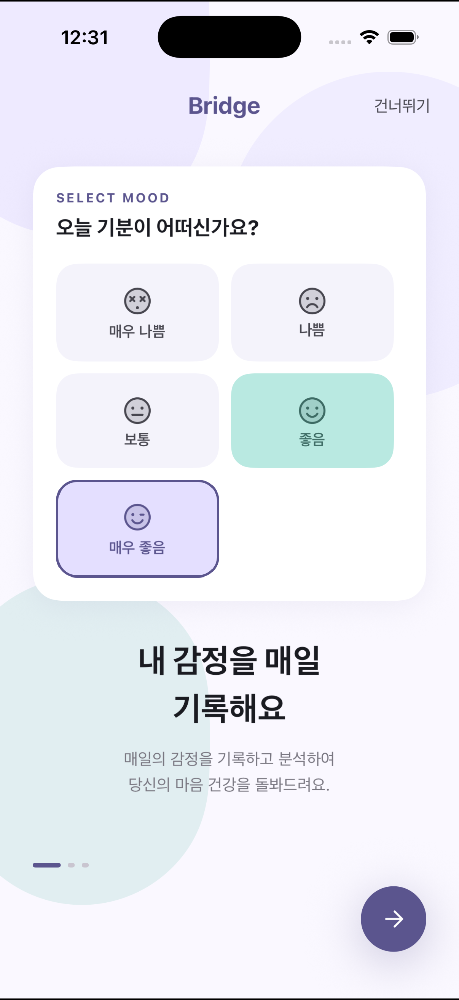
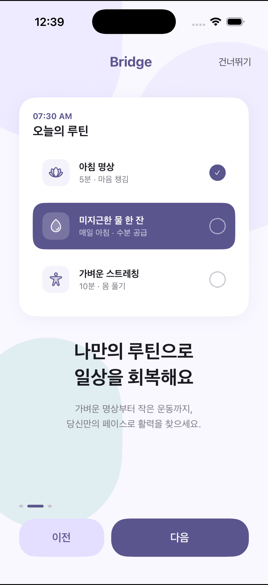
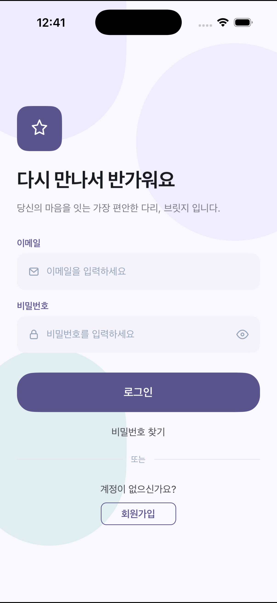
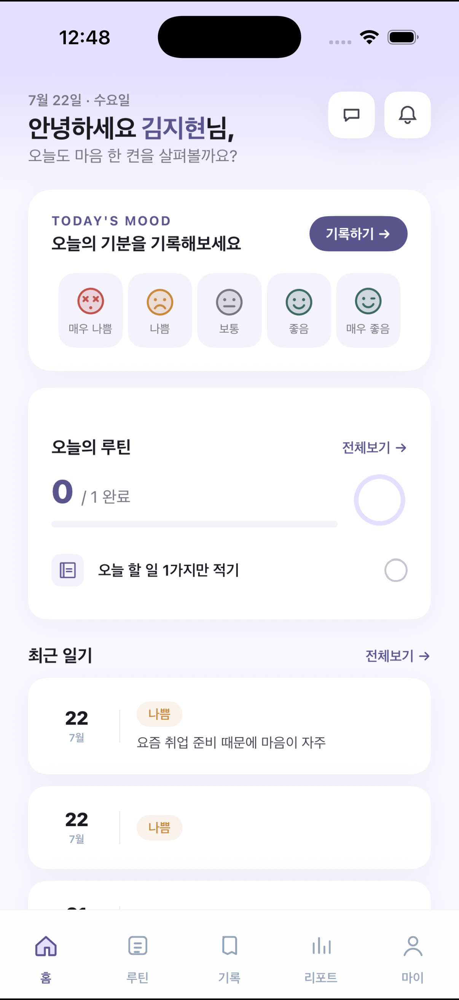
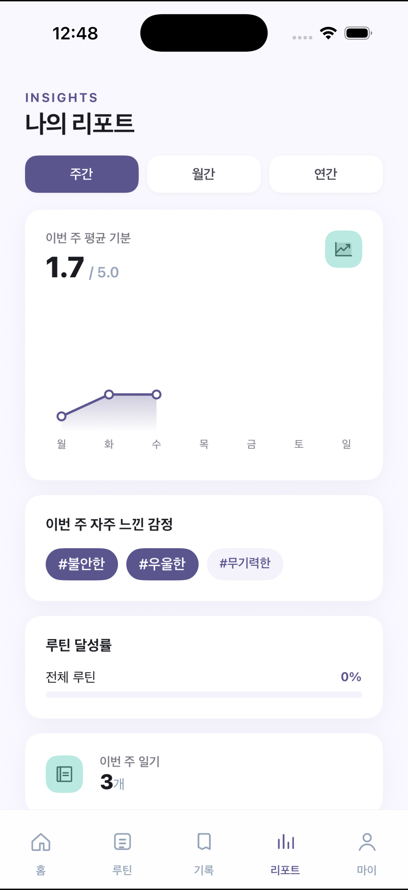
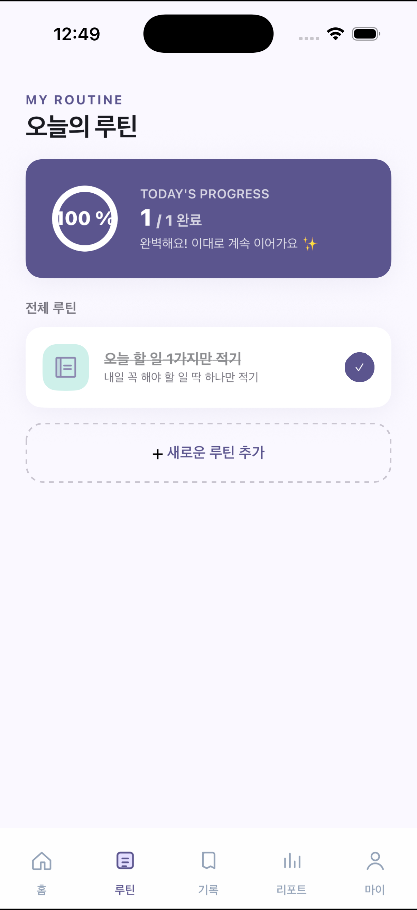
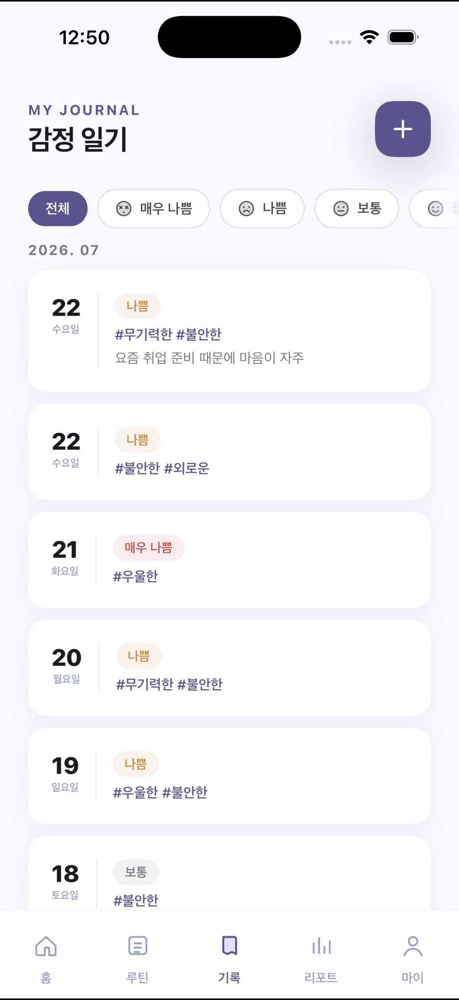
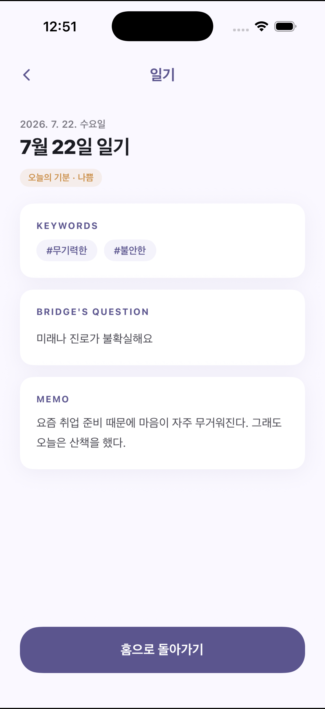
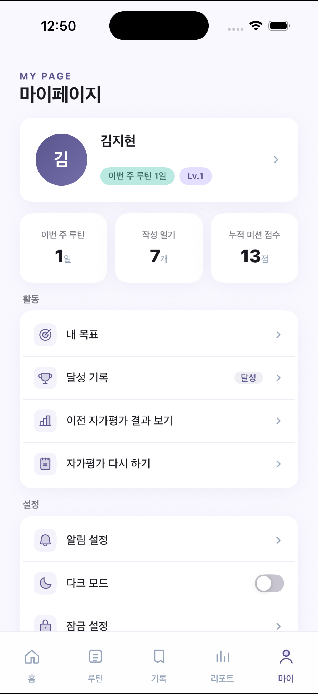

<div align="center">


# Bridge

**청년(19~34세) 디지털 정서 웰니스 플랫폼**

방치된 청년과 병원 사이의 *다리* 역할을 목표로,
감정 기록 · 루틴 형성 · 자기 이해를 통해 정서적 안녕을 돕습니다.


</div>

> **규제 포지셔닝** — Bridge는 진단·치료 서비스가 **아닙니다**.
> "정보 제공 및 습관 형성 도구"로 포지셔닝하며, 의료기기에 해당하지 않습니다.

---

## 📱 화면 미리보기

부드러운 라벤더·민트 파스텔 톤과 라운드 카드 UI로, 부담 없이 매일 감정을 기록하도록 설계했습니다.

<table>
  <tr>
    <td align="center" width="33%">
      <br/>
      <sub><b>온보딩 · 기분 선택</b><br/>이모지 5단계로 오늘의 기분을 고릅니다</sub>
    </td>
    <td align="center" width="33%">
      <br/>
      <sub><b>온보딩 · 루틴 미리보기</b><br/>명상·수분·스트레칭 등 나만의 루틴 소개</sub>
    </td>
    <td align="center" width="33%">
      <br/>
      <sub><b>로그인</b><br/>"당신의 마음을 잇는 가장 편안한 다리"</sub>
    </td>
  </tr>
  <tr>
    <td align="center" width="33%">
      <br/>
      <sub><b>홈 대시보드</b><br/>오늘의 기분·루틴 진행률·최근 일기를 한눈에</sub>
    </td>
    <td align="center" width="33%">
      <br/>
      <sub><b>리포트</b><br/>주간/월간/연간 기분 추이·자주 느낀 감정</sub>
    </td>
    <td align="center" width="33%">
      <br/>
      <sub><b>루틴 완료</b><br/>오늘의 루틴 진행률과 달성 피드백</sub>
    </td>
  </tr>
  <tr>
    <td align="center" width="33%">
      <br/>
      <sub><b>감정 일기 목록</b><br/>기분별 필터 + 날짜별 감정 키워드 태그</sub>
    </td>
    <td align="center" width="33%">
      <br/>
      <sub><b>일기 상세</b><br/>감정 키워드·세부 질문·메모(암호화 저장)</sub>
    </td>
    <td align="center" width="33%">
      <br/>
      <sub><b>마이페이지</b><br/>누적 미션 점수·달성 기록·자가평가 다시 하기</sub>
    </td>
  </tr>
</table>

---

## ✨ 주요 기능

- **감정 일기** — 이모지 → 감정 키워드 → 세부 질문 → 메모 흐름으로 하루의 기분을 짧게 기록. 메모는 AES-256-GCM으로 암호화 저장
- **자가평가 기반 초기 루틴 배정** — PHQ-9 자가평가 결과에 따라 개인화된 초기 루틴 프로파일을 자동 생성 (점수·구간명은 사용자에게 노출하지 않음)
- **근거 기반 루틴 트리거** — 최근 감정 패턴과 개인 기준선을 게이트 체인으로 판정해, 필요할 때만 루틴을 조용히 추천 (무발동이 기본값)
- **주간/월간 리포트** — 기분 추이 라인차트, 자주 느낀 감정, 루틴 달성률을 시각화
- **미션 점수 시스템** — 루틴 달성 70% + 일기 작성 30%로 주간 점수를 적립하는 가벼운 게이미피케이션
- **AI 정서 대화** — 외부 LLM 게이트웨이 기반 대화(전송 고지 · 의료 표현 자동 가드 통과)
- **프라이버시 우선** — 이메일은 SHA-256 해시로 검색, 민감 데이터 암호화, 익명 시작 및 회원 탈퇴 지원

---

## 🗂 모노레포 구성

```
bridge/
├── backend/                  FastAPI (Python 3.11) — REST API 서버
├── mobile/                   React Native + Expo (TypeScript) — 모바일 앱
├── docs/
│   ├── 01-plan/              PDCA Plan 문서
│   ├── 02-design/            PDCA Design 문서
│   ├── 03-analysis/          PDCA Analysis 문서
│   ├── 04-report/            PDCA Report 문서
│   ├── design/               Figma 디자인 자산
│   ├── screenshots/          앱 스크린샷 (README용)
│   ├── prototype/            HTML 프로토타입 (참고용)
│   ├── diagram/              시퀀스/아키텍처 다이어그램
│   └── Bridge_*.md           기획 문서 (PRD, API 명세, 시퀀스 등)
├── scripts/                  로컬 개발용 헬퍼 스크립트 (start/stop/dev/logs/reset-db)
├── docker-compose.yml        로컬 개발 환경 (api + db + redis)
├── docker-compose.prod.yml   운영 환경 (api + redis, DB는 RDS 사용)
└── CLAUDE.md                 AI 협업 가이드 (필독)
```

`backend/`와 `mobile/`은 완전히 독립된 프로젝트이며 HTTP로만 통신합니다.

---

## 🛠 기술 스택

### Backend
| 영역 | 기술 |
|------|------|
| 프레임워크 | FastAPI (Python 3.11) |
| ORM / 마이그레이션 | SQLAlchemy 2.0 (async) + Alembic |
| 인증 | python-jose (JWT) + passlib[bcrypt] |
| 암호화 | cryptography (AES-256-GCM) |
| 배치 / 트리거 | APScheduler + 자체 워커(`routine_trigger.py`) |
| DB / 캐시 | PostgreSQL 16 / Redis 7 |
| 컨테이너 | Docker Compose |
| 클라우드 | AWS EC2 + RDS PostgreSQL + S3 |

### Mobile
| 영역 | 기술 |
|------|------|
| 런타임 | React Native 0.74 + Expo SDK 51 |
| 언어 | TypeScript |
| 네비게이션 | React Navigation v6 (native-stack + bottom-tabs) |
| 상태 관리 | Zustand |
| 서버 상태 | TanStack React Query v5 + Axios |
| 시크릿 저장 | expo-secure-store (토큰) |
| 차트 | Victory Native |

### 인증·보안
- JWT: Access Token 1시간 / Refresh Token 14일
- 비밀번호: bcrypt(cost 12)
- 이메일: SHA-256 해시(`email_hash`)로 검색, 원문은 분리 저장
- 일기 메모·자가평가 결과: AES-256-GCM 암호화 저장
- 모든 API 통신: HTTPS(TLS 1.3)
- JWT 블랙리스트는 Redis로 관리

---

## 🚀 빠른 시작

### 1. 사전 요구사항
- Docker Desktop
- Node.js 18+ / npm
- (모바일 실기기 테스트 시) Expo Go 앱

### 2. 환경 변수 준비

```bash
cp backend/.env.example backend/.env   # 최초 1회
```

> `.env.example`의 기본값은 `docker-compose.yml`의 로컬 개발용 기본 비밀번호와 맞춰져 있어, 복사만 하면 바로 기동됩니다. (운영 배포 시에는 반드시 강한 값으로 교체하세요.)

### 3. 백엔드 + 모바일 한 번에 실행

```bash
./scripts/dev.sh
```

백엔드(api+db+redis)는 백그라운드로, Expo는 포그라운드로 떠 QR 코드를 보여줍니다.
`Ctrl+C`로 Expo만 종료되며 백엔드는 계속 살아있습니다 (정지: `./scripts/stop.sh`).

### 4. 백엔드만 따로 실행

```bash
./scripts/start.sh                     # 컨테이너 기동 + /health 폴링
curl http://localhost:8000/health      # 확인
```

- API 기본 주소: `http://localhost:8000`
- OpenAPI 문서: `http://localhost:8000/docs`

### 5. 모바일만 따로 실행

```bash
cd mobile
npm install                            # 최초 1회
npm start                              # Expo 시작
```

- iOS 시뮬레이터: `npm run ios`
- Android 에뮬레이터: `npm run android`
- 타입 체크: `npm run typecheck`

> 실기기에서 로컬 API에 접속하려면 `mobile/src` 내 API base URL을 본인 PC의 LAN IP(예: `http://192.168.x.x:8000`)로 변경해야 합니다. 자세한 내용은 `mobile/README.md` 참고.

### 6. 테스트

```bash
# 백엔드: API 서버가 떠 있는 상태에서 실행 (일부 테스트가 라이브 E2E)
./scripts/start.sh
docker compose exec api python -m pytest -q

# 모바일: 타입 체크 + 사용자 노출 문구 도메인 금지어 검사
cd mobile && npm run typecheck && npm run check:copy
```

---

## 🧰 스크립트 모음 (`scripts/`)

로컬 개발에서 자주 쓰는 명령을 묶어둔 헬퍼입니다. 모두 프로젝트 루트에서 실행합니다.

| 스크립트 | 역할 | 비고 |
|---------|------|------|
| `./scripts/start.sh` | 백엔드(api+db+redis) 백그라운드 기동 + `/health` 헬스체크 | 이미 떠있어도 안전 (idempotent) |
| `./scripts/stop.sh` | 컨테이너 정지 | DB 데이터는 보존됨 |
| `./scripts/dev.sh` | `start.sh` + `mobile`의 `npm start`까지 한 번에 실행 | Expo가 포그라운드로 떠 QR 코드 표시 |
| `./scripts/logs.sh [서비스]` | 로그 실시간 보기 | 인자 없으면 `api`, `all` 입력 시 전체 |
| `./scripts/reset-db.sh` | DB 볼륨 삭제 후 재기동 | ⚠️ 모든 데이터 삭제, `yes` 입력 확인 필요 |

---

## 🔄 핵심 데이터 흐름

```
자가평가(PHQ-9) → 초기 루틴 프로파일 생성
     ↓
일기 작성 (이모지 → 감정 키워드 → 세부 질문 → 메모)
     ↓
mood_score + 감정 키워드 → routine_trigger.py (비동기)
     ↓
트리거 조건 충족 시 → user_routines 갱신
     ↓
주간/월간 리포트 + 미션 점수 적립
```

### 트리거 알고리즘 요약
- 명시적 게이트 체인(G1 가용성 → G2a 키워드 후보 → G2b mood 편차 → G3 쿨다운 → G4 주간 상한 → G5 배정)으로 판정하며, 무발동이 기본값
- G2a 후보: 최근 7일 중 동일 감정 키워드 3회 이상, 빈도순 상위 2개
- G2b mood: 현재 mood가 개인 기준선(본인 과거 평균 − L×표준편차) 이하일 때만 통과 (콜드스타트·척도 최저치는 예외)
- 쿨다운: 3일 / 주간 상한: 최근 7일 롤링 최대 2건

자세한 로직은 `backend/app/routine_trigger.py`와 `docs/02-design/2026-07-21-트리거-재설계.design.md` 참고.

---

## 🔌 API 개요

Base URL: `https://api.bridge.app/v1` (로컬: `http://localhost:8000`)

| 모듈 | 주요 엔드포인트 |
|------|--------------|
| 인증 | `POST /auth/register`, `/auth/login`, `/auth/refresh`, `/auth/logout`, `/auth/anonymous`, `/auth/upgrade`, `/auth/verify-email`, `/auth/resend-verification`, `GET /auth/me` |
| 자가평가 | `POST /assessments`, `GET /assessments` |
| 일기 | `POST /diaries`, `GET /diaries`, `GET /diaries/{id}`, `PATCH /diaries/{id}`, `GET /diaries/today/status` |
| 키워드 | `GET /keywords/emotions` |
| 루틴 | `GET /routines/me`, `POST /routines/me`, `GET /routines/library`, `POST /routines/request`, `PATCH /routines/{id}/complete`, `DELETE /routines/{id}` |
| 리포트 | `GET /reports/weekly`, `GET /reports/monthly`, `GET /reports/mood-trend` |
| 미션 | `GET /missions/weekly`, `GET /missions/total` |
| 챗봇 | `POST /chat/messages`, `GET /chat/memories`, `DELETE /chat/memories` |
| 사용자 | `DELETE /users/me`, `POST`·`DELETE /users/me/push-token`, `GET`·`PATCH /users/me/notification-settings` |

전체 명세: `docs/Bridge_API_명세서.md`

---

## 📈 개발 진행 순서 (Phase)

| Phase | 기능 | 상태 |
|-------|------|------|
| 1 | Docker Compose + DB 스키마 + 키워드 시드 | ✅ 완료 |
| 2 | Auth Service (회원가입·로그인·JWT·로그아웃) | ✅ 완료 |
| 3 | 자가평가 API + 초기 루틴 배정 | ✅ 완료 |
| 4 | 일기 CRUD + AES-256-GCM 암호화 | ✅ 완료 |
| 5 | `routine_trigger.py` 비동기 실행 | ✅ 완료 |
| 6 | 루틴 관리 API | ✅ 완료 |
| 7 | 리포트 집계 + 주간 배치 스케줄러 | ✅ 완료 |
| 8 | 미션 점수 시스템 | ✅ 완료 |
| 9 | AWS 배포 | 🚧 진행 중 |

---

## ⚠️ 절대 하지 말아야 할 것

- LLM 기반 심리상담·진단 기능 구현 금지
- "치료 / 진단 / 개선 / 효과" 등 의료적 표현 사용 금지
- 사용자 정신건강 데이터 제3자 제공 금지
- 일기 메모·평가지를 평문으로 DB에 저장 금지
- PHQ-9 점수 수치를 사용자에게 직접 노출 금지
- "중등도 우울" 등 의학적 구간명을 사용자 화면에 노출 금지

### 표현 가이드

| 금지 | 허용 |
|------|------|
| 치료 | 회복, 관리 |
| 진단 | 확인, 파악 |
| 개선 | 변화, 기록 |
| 중등도 우울 | "지금 조금 지쳐있는 것 같아요" |
| PHQ-9 점수 표시 | 수치 비노출 |

---

## 📚 문서

| 파일 | 내용 |
|------|------|
| `CLAUDE.md` | AI 에이전트 협업 가이드(스택·규칙·금기 포함) |
| `docs/Bridge_PRD.md` | 기능 명세 전체 |
| `docs/Bridge_API_명세서.md` | API 엔드포인트 상세 |
| `docs/Bridge_기능설계_결정문서.md` | A~E 설계 결정 사항 |
| `docs/Bridge_시스템아키텍처.md` | 시스템 구조 |
| `docs/Bridge_시퀀스다이어그램.md` | 로그인·일기·JWT 갱신 흐름 |
| `docs/Bridge_화면정의서.md` | 화면별 구성 요소 |
| `docs/Bridge_정보아키텍처.md` | 정보 구조(IA) |
| `docs/Bridge_개인정보처리방침.md` | 법적 의무 문서 |
| `mobile/README.md` | 모바일 앱 개발 가이드 |

---

## 📄 라이선스

이 프로젝트는 [MIT License](LICENSE)로 배포됩니다.
